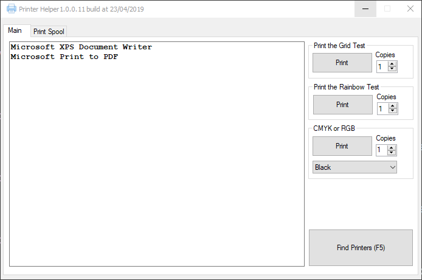
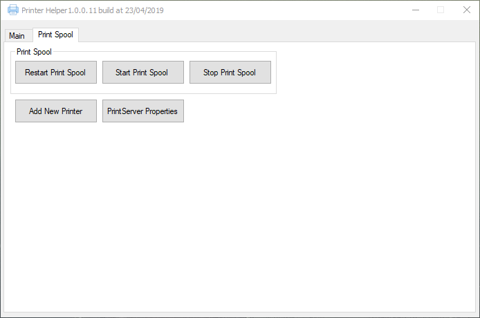
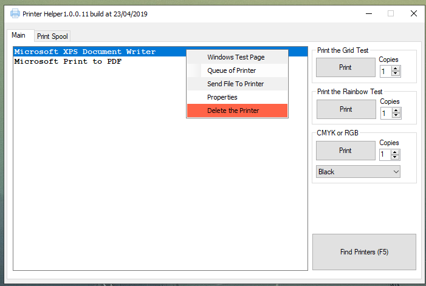
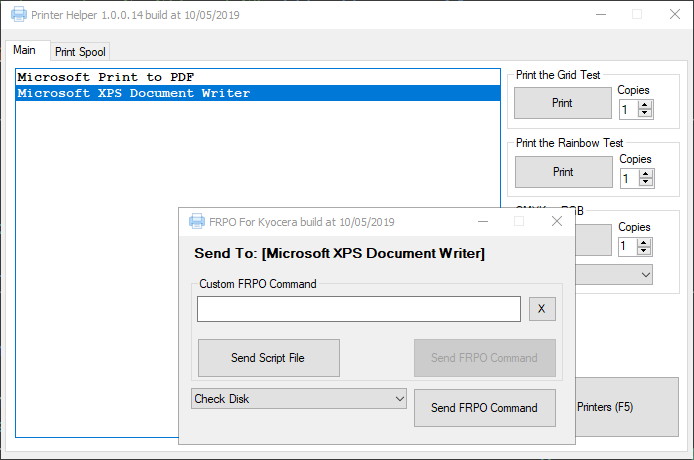

# MyPrintHelper

A simple utility for testing and interacting with monochrome and color printers, designed for use in a service center environment.

## Screenshots

| Main Interface                               | FRPO Command GUI                             |
| -------------------------------------------- | -------------------------------------------- |
|                   |                  |
| **Printer List & Test Pages**                | **Send Commands**                            |
|                  |             |
| **Test Grids**                               | **Test Rainbow**                             |
|                |           |

## Features

*   **Find Printers:** Discovers and lists all online printers connected to the system (ignores FAX and XPS devices).
*   **Print B/W Grid:** Prints a full A4 page with a black and white grid pattern to test toner/ink coverage and alignment.
*   **Print Rainbow:** Prints a 600x600 rainbow gradient to test color printing capabilities.
*   **Print Test Rectangle:** Send a 720x1000 pixel rectangle (CMYK or RGB) to the printer, covering almost a full A4 page.
*   **FRPO/PJL Commands:** A dedicated GUI allows sending `Prescribe` (FRPO) commands to compatible printers (e.g., Kyocera). You can send custom commands, load commands from a script file, or choose from a list of integrated commands. (PJL script support is theoretical and not yet tested).

## How It Works

*   The application uses standard Windows printing APIs to communicate with printers.
*   It filters out virtual devices like "Microsoft XPS Document Writer" and "Microsoft Print to PDF" to show only physical printers.
*   The test page generation is done programmatically to create the specific patterns.

## Known Issues

*   Some HP printers may still appear in the list even when powered off, as they remain in the system with `Local = True` and `WorkOffline = true` flags.

## Building from Source

This is a C# .NET Framework project. You can open the `PrinterHelper.sln` file in Visual Studio and build the solution.
